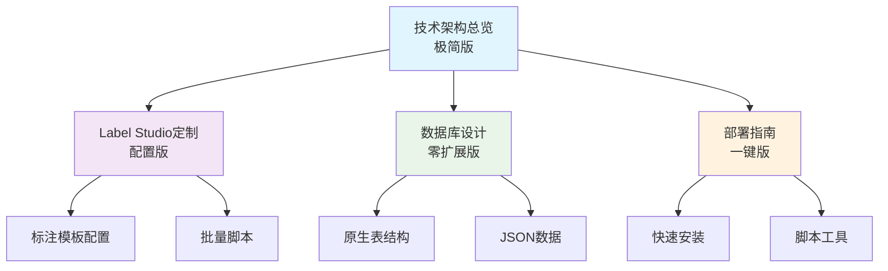

# 技术文档索引 (极简版)

## 技术架构设计文档导航

### 概述
本技术文档体系基于Label Studio构建敏感实体标注服务的**极简技术方案**，追求最少依赖、最快部署、最易维护的架构设计。

## 📁 文档结构

### 1. 技术架构总览 ([technical_architecture_overview.md](./technical_architecture_overview.md))
**核心文档** - 极简架构设计和技术选型

#### 主要内容
- **极简架构**: 单一Label Studio服务 + SQLite/PostgreSQL
- **零中间件**: 移除Redis、Celery、Nginx等复杂组件
- **配置驱动**: 通过标注模板和脚本实现定制
- **5分钟部署**: 一键安装启动方案

#### 适用角色
- 技术架构师
- 项目经理
- 开发工程师

---

### 2. Label Studio定制化方案 ([label_studio_customization.md](./label_studio_customization.md))
**实施指南** - 基于配置的零代码定制方案

#### 主要内容
- **标注模板**: 敏感实体NER专用XML配置
- **批量脚本**: Python脚本实现数据导入导出
- **零开发**: 无需Django应用开发
- **纯配置**: 通过配置实现所有定制需求

#### 适用角色
- 系统配置员
- 标注项目管理员
- 技术实施人员

---

### 3. 数据库设计 ([database_design.md](./database_design.md))
**数据架构** - 零扩展的纯原生表设计

#### 主要内容
- **原生表**: 完全使用Label Studio原生表结构
- **零扩展**: 不添加任何自定义表
- **JSON驱动**: 通过JSON字段存储业务数据
- **最小维护**: 无数据库迁移和维护成本

#### 适用角色
- 数据架构师
- 系统管理员
- 运维工程师

---

### 4. 部署指南 ([deployment_guide.md](./deployment_guide.md))
**运维手册** - 极简部署和运维方案

#### 主要内容
- **3分钟部署**: `pip install label-studio && label-studio start`
- **零配置**: 开箱即用，无复杂配置
- **单一服务**: 仅Label Studio一个服务
- **脚本工具**: 简单的维护和备份脚本

#### 适用角色
- 运维工程师
- 系统管理员
- 技术实施人员

## 🔗 文档关联关系

## 📋 推荐阅读顺序

### 🎯 角色导向阅读路径

#### 技术决策者 / 项目经理
1. **技术架构总览** - 了解极简架构优势
2. **部署指南** (第8-9节) - 评估部署简单性
3. **数据库设计** (第10节) - 确认零维护成本

#### 技术实施人员
1. **部署指南** (第3节) - 5分钟快速部署
2. **Label Studio定制化** - 配置标注模板
3. **技术架构总览** (第4节) - 理解标注配置

#### 系统管理员
1. **部署指南** - 完整部署和维护
2. **数据库设计** (第6-8节) - 备份和监控
3. **技术架构总览** (第9节) - 升级策略

### 🚀 任务导向阅读路径

#### 立即部署 (10分钟)
1. **部署指南** (第3节) - 快速部署脚本
2. **Label Studio定制化** (第2节) - 导入标注模板
3. **Label Studio定制化** (第3节) - 导入demo数据

#### 生产使用 (30分钟)
1. **技术架构总览** - 理解整体设计
2. **部署指南** (第6节) - 生产环境配置
3. **Label Studio定制化** (第3-4节) - 批量操作脚本
4. **数据库设计** (第6节) - 备份策略

#### 功能扩展 (1小时)
1. **技术架构总览** (第9节) - 扩展策略
2. **Label Studio定制化** (第10节) - 高级功能
3. **数据库设计** (第9节) - 迁移策略

## 🛠 极简技术栈

### 核心组件
- **标注平台**: Label Studio Community Edition
- **数据库**: SQLite (开发) / PostgreSQL (生产)
- **部署**: Python虚拟环境 / Docker (可选)
- **工具**: Python脚本

### 移除的组件 ✂️
- ❌ Redis缓存
- ❌ Celery任务队列
- ❌ Nginx负载均衡
- ❌ Django自定义应用
- ❌ 复杂的数据库扩展
- ❌ 容器编排

## 🎯 极简架构特色

### 技术亮点
- **部署简单**: 一行命令启动服务
- **零维护**: 无中间件，无自定义代码
- **易扩展**: 需要时可渐进式升级
- **成本低**: 最少的服务器资源消耗

### 使用优势
- **学习成本低**: 仅需了解Label Studio操作
- **故障排除简单**: 单一服务，问题定位容易
- **升级无风险**: 完全兼容Label Studio生态
- **迁移方便**: 标准数据格式，易于迁移

## 📊 适用场景

### ✅ 适合的场景
- 2万以下的中小规模标注任务
- 10人以下的标注团队
- 快速原型验证
- 预算和资源受限的项目
- 需要快速上线的紧急项目

### 🔄 升级时机
- 并发用户 > 10人
- 任务量 > 10万
- 需要复杂统计分析
- 需要高可用部署
- 需要与其他系统深度集成

## 📞 支持和反馈

### 使用帮助
- **快速开始**: 按部署指南3分钟上手
- **问题排查**: 查看部署指南故障排除章节
- **功能扩展**: 参考技术架构总览升级建议

### 成功指标
- 🎯 5分钟内完成服务启动
- 🎯 10分钟内完成demo数据导入
- 🎯 30分钟内开始标注工作
- 🎯 零配置即可使用核心功能

---

**设计理念**: 用最简单的方式解决核心问题，避免过度工程化，确保项目快速成功。  
**文档版本**: v2.0 (极简版)  
**维护团队**: 敏感实体标注项目技术团队 