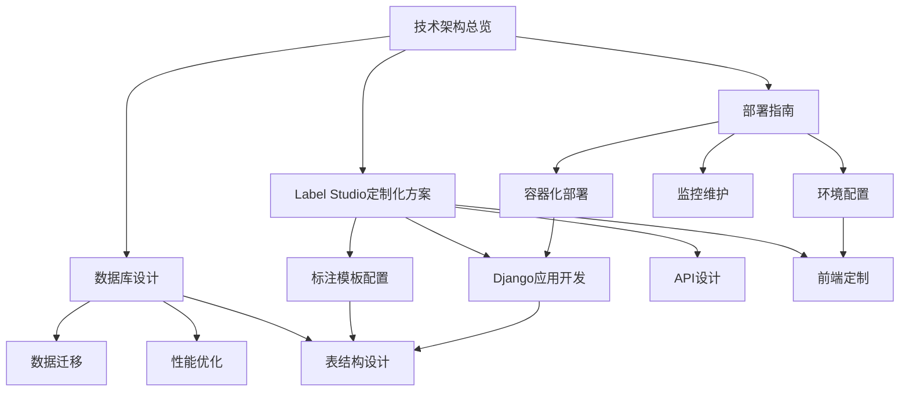

# 技术文档索引

## 技术架构设计文档导航

### 概述
本技术文档体系基于Label Studio构建敏感实体标注服务的完整技术方案，涵盖架构设计、定制开发、数据库设计和部署方案。

## 📁 文档结构

### 1. 技术架构总览 ([technical_architecture_overview.md](./technical_architecture_overview.md))
**核心文档** - 系统整体技术架构和设计原则

#### 主要内容
- 架构设计原则和技术约束
- 系统整体架构图和核心组件
- 技术选型表和Label Studio专用组件
- 数据库设计、API扩展和前端定制
- 部署架构、安全设计和监控方案

#### 适用角色
- 技术架构师
- 项目经理
- 开发团队领导

---

### 2. Label Studio定制化方案 ([label_studio_customization.md](./label_studio_customization.md))
**实施指南** - 基于Label Studio的具体定制开发方案

#### 主要内容
- 定制化策略和标注模板配置
- 自定义Django应用开发
- 批量导入/导出API设计
- 前端CSS和JavaScript增强
- 管理命令和集成配置

#### 适用角色
- 后端开发工程师
- 前端开发工程师
- DevOps工程师

---

### 3. 数据库设计 ([database_design.md](./database_design.md))
**数据架构** - 数据库扩展设计和性能优化

#### 主要内容
- 非侵入式扩展设计原则
- 核心扩展表结构设计
- 统计视图和存储过程
- 性能优化和索引策略
- 数据迁移和监控维护

#### 适用角色
- 数据库架构师
- 后端开发工程师
- 系统管理员

---

### 4. 部署指南 ([deployment_guide.md](./deployment_guide.md))
**运维手册** - 完整的部署和运维方案

#### 主要内容
- Docker容器化部署方案
- 开发和生产环境配置
- 一键部署脚本和环境配置
- 监控维护和故障排除
- SSL证书和安全配置

#### 适用角色
- DevOps工程师
- 系统管理员
- 运维工程师

## 🔗 文档关联关系

## 📋 推荐阅读顺序

### 🎯 角色导向阅读路径

#### 技术架构师 / 项目经理
1. **技术架构总览** - 理解整体架构设计
2. **数据库设计** - 审查数据架构合理性
3. **Label Studio定制化方案** - 评估实现可行性
4. **部署指南** - 确认部署方案

#### 后端开发工程师
1. **技术架构总览** (第2-5节) - 了解技术选型和组件设计
2. **Label Studio定制化方案** - 具体实现指导
3. **数据库设计** - 数据模型和API设计
4. **部署指南** (第3-4节) - 本地开发环境搭建

#### 前端开发工程师
1. **技术架构总览** (第2.2节) - 前端技术栈
2. **Label Studio定制化方案** (第2.1和5.3节) - 标注模板和前端定制
3. **部署指南** (第3.2节) - 开发环境配置

#### DevOps / 运维工程师
1. **技术架构总览** (第6节) - 部署架构
2. **部署指南** - 完整部署流程
3. **数据库设计** (第5-6节) - 数据迁移和监控
4. **Label Studio定制化方案** (第6节) - 集成配置

### 🚀 任务导向阅读路径

#### 快速原型搭建
1. **部署指南** (第5节) - 一键部署脚本
2. **Label Studio定制化方案** (第2节) - 标注模板配置
3. **技术架构总览** (第3.2节) - 基本配置

#### 生产环境部署
1. **技术架构总览** - 全面理解架构
2. **数据库设计** - 数据库设计和优化
3. **部署指南** - 生产环境部署
4. **Label Studio定制化方案** (第6节) - 生产配置

#### 功能扩展开发
1. **Label Studio定制化方案** - 定制开发方案
2. **数据库设计** (第2节) - 扩展表设计
3. **技术架构总览** (第5.2节) - API扩展设计

## 🛠 技术栈概览

### 核心技术
- **标注平台**: Label Studio Community Edition
- **后端框架**: Django 4.2+ (Label Studio原生)
- **前端框架**: React 18+ (Label Studio前端)
- **数据库**: PostgreSQL 14+
- **缓存**: Redis 7+
- **容器化**: Docker & Docker Compose

### 扩展组件
- **任务队列**: Celery
- **Web服务器**: Nginx
- **监控**: 系统健康检查和性能监控
- **安全**: SSL/TLS加密、权限控制

## 🎯 项目特色

### 技术亮点
- **非侵入式扩展**: 基于Label Studio构建，保持兼容性
- **快速部署**: 一键部署脚本，5分钟内完成环境搭建
- **专业化定制**: 针对敏感实体标注的专门优化
- **大规模支持**: 支持2万任务的批量处理

### 架构优势
- **成本可控**: 最大化复用现有功能
- **易于维护**: 保持与Label Studio生态兼容
- **扩展性强**: 支持水平扩展和性能优化
- **安全设计**: 完善的数据安全和访问控制

## 📞 支持和反馈

### 技术文档维护
- 文档版本与代码同步更新
- 定期review确保准确性
- 根据实际部署经验持续优化

### 问题反馈渠道
- GitHub Issues: 技术问题和改进建议
- 项目Wiki: 常见问题解答
- 团队会议: 架构讨论和决策

---

**最后更新**: 2024年技术架构设计阶段  
**文档版本**: v1.0  
**维护团队**: 敏感实体标注项目技术团队 