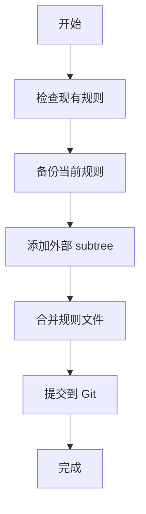
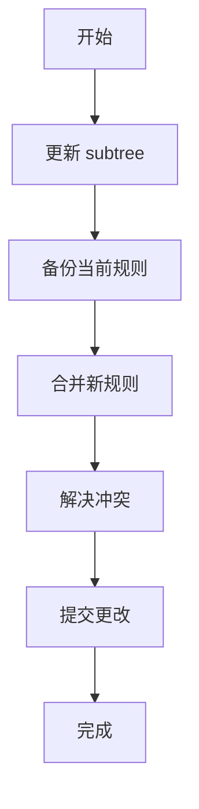

# Cursor Rules Integration Guide

本指南说明如何使用 `manage-cursor-rules.sh` 脚本来集成和管理外部 Cursor 规则仓库。

## 概述

该脚本使用 Git subtree 技术来集成 [MyCursorRules](https://github.com/ForeverNewLee/MyCursorRules) 仓库，确保在多机器、多地址环境下的一致性，同时不影响现有的 `.cursor/rules` 配置。

## 主要特性

- ✅ **多机器同步**: 使用 Git subtree 确保所有机器上的配置一致
- ✅ **无冲突集成**: 自动备份和合并本地与外部规则
- ✅ **版本控制**: 所有变更都通过 Git 进行版本控制
- ✅ **安全备份**: 自动备份现有配置，防止数据丢失
- ✅ **智能合并**: 处理规则文件冲突，保持本地和外部规则

## 使用方法

### 1. 首次设置

```bash
# 添加外部规则仓库作为 subtree
./scripts/manage-cursor-rules.sh add

# 合并规则到 .cursor/rules 目录
./scripts/manage-cursor-rules.sh merge
```

### 2. 更新外部规则

```bash
# 更新外部规则仓库
./scripts/manage-cursor-rules.sh update

# 重新合并规则
./scripts/manage-cursor-rules.sh merge
```

### 3. 查看状态

```bash
# 检查当前集成状态
./scripts/manage-cursor-rules.sh status
```

### 4. 清理

```bash
# 清理临时文件和旧备份
./scripts/manage-cursor-rules.sh cleanup
```

## 工作流程

### 初始集成工作流



### 更新工作流



## 文件结构

```
项目根目录/
├── .cursor/
│   ├── rules/                    # 最终的规则目录
│   │   ├── react.mdc            # 本地/合并的 React 规则
│   │   ├── typescript.mdc       # 本地/合并的 TypeScript 规则
│   │   ├── tailwind.mdc         # 本地/合并的 Tailwind 规则
│   │   └── ...                  # 其他规则文件
│   └── rules_backup_YYYYMMDD_HHMMSS/  # 自动备份目录
├── external-cursor-rules/        # 外部规则 subtree（临时）
│   └── ...                      # 外部仓库内容
└── scripts/
    ├── manage-cursor-rules.sh    # 管理脚本
    └── cursor-rules-integration.md  # 本文档
```

## 规则合并策略

### 无冲突情况
- 本地独有的规则文件 → 保留
- 外部独有的规则文件 → 添加

### 冲突情况
- 同名规则文件 → 创建合并文件，包含本地和外部规则
- 合并文件会清楚标识本地和外部内容
- 需要手动审查和整理合并后的文件

## 多机器同步

### 第一台机器（设置者）
```bash
# 初始设置
./scripts/manage-cursor-rules.sh add
./scripts/manage-cursor-rules.sh merge
git add .
git commit -m "Add MyCursorRules integration"
git push
```

### 其他机器（使用者）
```bash
# 拉取最新代码
git pull

# 如果需要更新外部规则
./scripts/manage-cursor-rules.sh update
./scripts/manage-cursor-rules.sh merge
```

## 注意事项

1. **备份安全**: 脚本会自动备份现有规则，备份保留 7 天
2. **冲突处理**: 当本地和外部规则冲突时，会创建包含两者的合并文件
3. **Git 集成**: 所有操作都会反映在 Git 历史中，便于追踪
4. **清理机制**: 使用 `cleanup` 命令清理临时文件和旧备份

## 故障排除

### 问题：subtree 已存在
```bash
# 解决方案：清理后重新添加
./scripts/manage-cursor-rules.sh cleanup
./scripts/manage-cursor-rules.sh add
```

### 问题：合并冲突
```bash
# 解决方案：检查 .cursor/rules 中的合并文件，手动整理
ls -la .cursor/rules/
# 编辑包含 "LOCAL RULES" 和 "EXTERNAL RULES" 标记的文件
```

### 问题：权限错误
```bash
# 解决方案：确保脚本有执行权限
chmod +x scripts/manage-cursor-rules.sh
```

## 最佳实践

1. **定期更新**: 建议每周运行一次 `update` 和 `merge`
2. **提交规则**: 将合并后的规则提交到版本控制
3. **团队协作**: 确保团队成员都使用相同的脚本和流程
4. **文档维护**: 如有自定义修改，请更新此文档

## 自定义配置

如需修改配置，请编辑脚本顶部的变量：

```bash
# 修改外部仓库地址
MYCURSOR_REPO="https://github.com/YourUsername/YourCursorRules.git"

# 修改 subtree 前缀
SUBTREE_PREFIX="your-cursor-rules"

# 修改目标目录
TARGET_DIR=".cursor/rules"
``` 